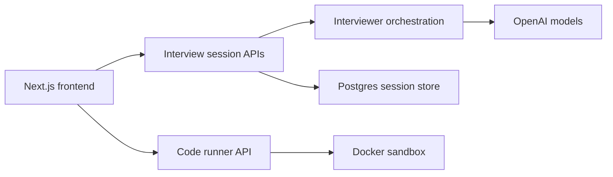

# MockDev

MockDev is an AI-powered technical interview platform that simulates a realistic software engineering interview from prompt to debrief.

It combines an interviewer agent, a live coding workspace, safe code execution, session memory, and optional voice support into one product designed for interview practice.

## What it does

- Runs mock SWE interviews with an AI interviewer that can introduce problems, ask follow-ups, give hints, and adapt tone.
- Supports multiple interviewer modes such as strict interviewer, friendly coach, and FAANG-style pressure mode.
- Provides an in-browser coding workspace with Monaco, language switching, stdin, console output, and hidden test cases.
- Executes code in isolated Docker sandboxes with CPU, memory, process, and network restrictions.
- Persists user sessions, transcripts, hints, code runs, and summaries in Postgres.

## Why I built it

I wanted a mock interview tool that felt closer to a real interview loop than a normal chatbot. Most practice tools either stop at static problems or give away too much too quickly. MockDev is built to behave more like a senior engineer interviewing a candidate, while still being useful for deliberate practice.

## Tech stack

- Next.js
- TypeScript
- Tailwind CSS
- OpenAI APIs
- Monaco Editor
- Postgres
- Docker
- Vercel

## Core product areas

### 1. Interview orchestration

The interviewer is prompt-driven and session-aware. It keeps track of:

- current problem
- transcript
- prior hints
- selected language
- execution history
- interview mode and difficulty

It can answer commands like:

- `give me a hint`
- `repeat the question`
- `what do you think of my approach?`
- `am I missing an edge case?`
- `can you ask a follow-up?`

### 2. Coding workspace

The interview workspace includes:

- Monaco editor
- language selection for Python, JavaScript, Java, C++, and Go
- run with stdin
- hidden and visible test cases
- per-question starter templates
- console output and compile/runtime feedback

### 3. Secure code execution

Each execution runs inside a restricted Docker container with:

- no outbound network access
- strict timeout limits
- CPU and memory caps
- PID limits
- compile/runtime error reporting

### 4. Persistence and auth

The app uses a Postgres-backed session model plus lightweight cookie auth. I also added:

- route protection
- Zod request validation
- parameterized SQL
- per-user session history
- interview summaries and replayable prior sessions

## Architecture

## Public repo note

This public repository is a portfolio-safe version of the project. It is meant to document the architecture, product decisions, and implementation approach without exposing private environment configuration or internal development history.

## Highlights I would talk about in an interview

- Designed a full-stack interview simulation product instead of a single chat UI.
- Separated UI, orchestration, persistence, and sandboxed execution into distinct layers.
- Treated untrusted code execution as an infrastructure problem, not just an API route.
- Built for extensibility with different interview modes, question banks, and execution languages.

## Live demo

- App: [interview-prepper-seven.vercel.app](https://interview-prepper-seven.vercel.app)

